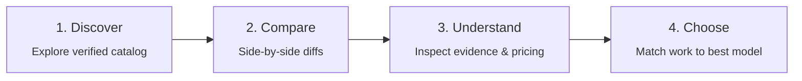

<div align="center">

<a href="https://github.com/D-Flint/ai-model-web">
  
</a>

# Synapse

**A consumer-first AI model decision engine for finding the right model for the work in front of you.**

[](https://astro.build)
[](https://react.dev)
[](https://www.typescriptlang.org/)
[](https://workers.cloudflare.com/)
[](LICENSE)

<p>
  <strong>Quick Jump:</strong>
  <a href="#part-1-user-guide">User Guide</a> &bull;
  <a href="#part-2-developer-guide">Developer Guide</a> &bull;
  <a href="#license--attribution">License</a>
</p>

</div>

---

## Table of Contents

- [Part 1: User Guide](#part-1-user-guide)
  - [1. The Decision Journey](#1-the-decision-journey)
  - [2. Why Synapse? (Decision Engine vs. Leaderboard)](#2-why-synapse-decision-engine-vs-leaderboard)
  - [3. Key Features & Capabilities](#3-key-features--capabilities)
  - [4. How to Use Synapse (Workflows & Walkthroughs)](#4-how-to-use-synapse-workflows--walkthroughs)
    - [Exploring & Filtering the Catalog](#exploring--filtering-the-catalog)
    - [Comparing Models Side-by-Side](#comparing-models-side-by-side)
    - [Selecting Workload Profiles & Cache Efficiency](#selecting-workload-profiles--cache-efficiency)
    - [Using the Guided Model Finder](#using-the-guided-model-finder)
    - [Calculating Real-World API Costs](#calculating-real-world-api-costs)
  - [5. Understanding the Data: Tiers, Provenance & Confidence](#5-understanding-the-data-tiers-provenance--confidence)
  - [6. Accessibility, Privacy & UI Resilience](#6-accessibility-privacy--ui-resilience)
- [Part 2: Developer Guide](#part-2-developer-guide)
  - [1. Architecture & Tech Stack](#1-architecture--tech-stack)
  - [2. Repository Structure](#2-repository-structure)
  - [3. Prerequisites & Local Setup](#3-prerequisites--local-setup)
  - [4. Development Commands & Workflows](#4-development-commands--workflows)
  - [5. Testing & Quality Assurance](#5-testing--quality-assurance)
  - [6. Data Ingestion & Scoring Pipeline](#6-data-ingestion--scoring-pipeline)
  - [7. Database Persistence & Drizzle ORM](#7-database-persistence--drizzle-orm)
  - [8. Environment Configuration](#8-environment-configuration)
  - [9. Edge Deployment (Cloudflare Workers)](#9-edge-deployment-cloudflare-workers)
  - [10. Architecture Documentation & Guides](#10-architecture-documentation--guides)
- [License & Attribution](#license--attribution)

---

# Part 1: User Guide

Welcome to **Synapse**! This section covers everything you need to know as an end user, evaluator, decision maker, or engineer looking for the best AI model for your specific project, team, or personal workflow.

---

### 1. The Decision Journey

Choosing an AI model is rarely about finding a single "best" model. A model that excels at complex code refactoring might be prohibitively slow or expensive for real-time customer support, while a fast, cost-effective chat model may stumble on nuanced mathematical reasoning.

Synapse organizes your evaluation around a 4-stage decision progression:



1. **Discover**: Browse a curated, verified catalog of leading frontier, open-weights, and specialized AI models without marketing hyperbole.
2. **Compare**: Evaluate 2 to 4 models simultaneously across technical capabilities, context limits, latency metrics, and real-world API costs.
3. **Understand**: Inspect underlying benchmark evidence, verification timestamps, and confidence tiers instead of relying on black-box rankings.
4. **Choose**: Select the model that delivers the right tradeoff between capability, speed, and budget for your exact workload.

---

### 2. Why Synapse? (Decision Engine vs. Leaderboard)

Traditional AI leaderboards compress hundreds of complex model behaviors into a single aggregate score. This creates significant problems:

- **Misleading Averages**: A model with high synthetic benchmark numbers might struggle with structured JSON output, tool calling, or multi-turn agentic loops.
- **Hidden Cost Traps**: Models are often praised for raw intelligence without factoring in token pricing, output premiums, or whether they support prompt caching discounts.
- **Unverified Claims**: Marketing announcements frequently cite cherry-picked benchmark scores that third-party evaluators cannot reproduce.
- **Opaque Methodology**: You are rarely shown when the data was retrieved, which model version was tested, or what criteria decided the ranking.

> [!IMPORTANT]
> **Synapse is a Decision Engine, Not a Leaderboard**
> Synapse does not reduce AI models to a single deceptive rank. Raw benchmarks, derived scores, confidence intervals, source freshness, and reviewed API rates are presented as decision inputs—giving you transparent context to choose the right model for your specific workload.

---

### 3. Key Features & Capabilities

| Capability                    | What Synapse Delivers                                                                                                                                                    |
| :---------------------------- | :----------------------------------------------------------------------------------------------------------------------------------------------------------------------- |
| **Catalog Explorer**          | Filter and search models across modalities (Text, Vision, Audio), providers, context windows (up to 2M+ tokens), open-weights availability, and pricing tiers.           |
| **Side-by-Side Comparison**   | Compare 2 to 4 models across 27 distinct technical, operational, and financial dimensions with clear status indicators and shareable permalinks.                         |
| **Workload Profiles**         | Switch between real-world workload profiles (**Agent & Coding**, **General Chat**, **One-Shot**) to see how prompt caching discounts dramatically shift cost efficiency. |
| **Task-Focused Rankings**     | Explore transparent rankings tailored to specific jobs: General Reasoning, Coding & Software Engineering, Multimodal Analysis, Low-Latency Speed, and Cost Efficiency.   |
| **Guided Model Finder**       | Answer 3 simple questions about your use case, speed requirements, and budget to receive an explainable, deterministic shortlist.                                        |
| **Workload Cost Calculator**  | Calculate exact inference costs using verified input, output, and cached token pricing rather than simplified blended estimates.                                         |
| **Full Provenance Inspector** | Every fact, benchmark, and price links directly to its primary source with retrieval timestamps and confidence indicators.                                               |

---

### 4. How to Use Synapse (Workflows & Walkthroughs)

#### Exploring & Filtering the Catalog

On the main catalog page (`/`), you can quickly narrow down the field of models:

- **Search**: Find models by name, family (e.g., Claude, GPT, Gemini, DeepSeek, Qwen), or provider.
- **Modalities**: Filter for models that natively accept image, audio, or video inputs.
- **Capabilities**: Filter by support for tool calling (function calling), structured JSON outputs, or open-weights licensing.
- **Context Length**: Set minimum context window thresholds (e.g., 128k, 1M, or 2M tokens) for document analysis and long-context codebases.

#### Comparing Models Side-by-Side

Navigate to `/compare` to place up to 4 models into a synchronized comparison matrix:

1. **Model Selection**: Choose your candidate models using the multi-selector dropdowns or pre-configured match-up chips.
2. **Technical Facts Matrix**: Inspect clear status badges indicating support for Vision, Audio, Tool Use, Structured Outputs, API Availability, and Open Weights.
3. **Evidence Scores**: Review normalized 0–100 scores across Reasoning, Coding, Multimodal, and Speed dimensions.
4. **Shareable Permalinks**: Every comparison generates a unique URL (e.g., `/compare/claude-3-7-sonnet-vs-gpt-4o`) so you can share your evaluation directly with your team.

#### Selecting Workload Profiles & Cache Efficiency

Model pricing cannot be judged by base input rates alone. Modern agentic workflows and coding assistants reuse large prompt contexts across repeated turns.

Synapse features an interactive **Workload Profile Switcher** on the comparison page:

| Profile                        | Workload Description                                                 | Token Distribution                                              |
| :----------------------------- | :------------------------------------------------------------------- | :-------------------------------------------------------------- |
| **Agent & Coding** _(Default)_ | Long multi-turn agentic loops, IDE context, repeated repo prompts.   | **75% Cached** &bull; **20% Fresh Input** &bull; **5% Output**  |
| **General Chat**               | Balanced multi-turn conversation and document question answering.    | **50% Cached** &bull; **40% Fresh Input** &bull; **10% Output** |
| **One-Shot**                   | Single independent queries, batch extraction, zero prompt cache hit. | **0% Cached** &bull; **75% Fresh Input** &bull; **25% Output**  |

Switching profiles dynamically recalculates the **Cost Efficiency Score** and **Blended Cost per Million Tokens**, highlighting models with generous prompt caching discounts (such as 75%–90% reductions on cached reads).

#### Using the Guided Model Finder

If you aren't sure where to start, open the **Model Finder** (`/finder`):

1. **Step 1: Your Primary Task** — Select whether you are building coding tools, writing & research assistants, high-throughput agents, or multimodal workflows.
2. **Step 2: Latency & Speed Priority** — Specify whether maximum reasoning depth or instant real-time responsiveness matters most.
3. **Step 3: Budget Constraint** — Set your pricing ceiling (from free/open-source to frontier flagship).
4. **Result**: Synapse calculates an explainable, deterministic match with plain-language rationale explaining why each model fits your criteria.

#### Calculating Real-World API Costs

Visit the **Cost Calculator** (`/cost`) to forecast infrastructure expenses:

- Enter your estimated monthly token volume (input, output, and expected prompt cache hit rate).
- See a side-by-side cost projection across eligible models.
- Flag unverified or missing pricing immediately—Synapse never assumes an unverified rate is free.

---

### 5. Understanding the Data: Tiers, Provenance & Confidence

Synapse strictly partitions all data into 4 information tiers so you always know what is a proven fact, an external test, or a derived estimate:

| Information Tier       | What It Covers                                                                    | Provenance & Guardrails                                                                           |
| :--------------------- | :-------------------------------------------------------------------------------- | :------------------------------------------------------------------------------------------------ |
| **Provider Facts**     | Context limits, supported modalities, tool use, availability, reviewed API rates. | Direct publisher documentation URL, source type, retrieval timestamp, and verification date.      |
| **Public Evaluations** | LMSYS Chatbot Arena, SWE-bench Verified, LiveBench evaluation results.            | Original native benchmark metric, scale conversion formula, evaluator source, and snapshot date.  |
| **Derived Scores**     | Normalized 0–100 scores for Reasoning, Coding, Multimodal, and Cost Efficiency.   | Transparent scoring formulas, versioned weightings, confidence levels, and evidence citations.    |
| **Estimates**          | User workload token projections and blended $/1M token calculations.              | Explicit token splits, pricing scope, and missing-rate flags. Zero-rate assumption is disallowed. |

#### Confidence Ratings

Each score displays a confidence rating based on data freshness and verification completeness:

- **High Confidence**: Backed by recent first-party provider documentation and validated public evaluations.
- **Medium Confidence**: Supported by established benchmarks with pending updates for the latest model minor release.
- **Low / Unverified**: Model specs undergoing manual review or missing authoritative pricing. Labeled plainly so you know to test independently.

---

### 6. Accessibility, Privacy & UI Resilience

- **Calm, High-Contrast Design**: Optimized for readability across dark and light modes, avoiding neon saturation, sensory overload, and unnecessary animation.
- **WCAG Compliant Badges**: Feature availability uses distinct text and iconography (`Check` for supported, `X` for unsupported) rather than ambiguous color-only fills.
- **Keyboard & Screen-Reader Accessible**: All interactive tables, dropdowns, and comparison tools are fully navigable using keyboard tab stops and standard ARIA attributes.
- **Zero-JavaScript Resilience**: Built on Astro server-rendered HTML. The core catalog, comparison tables, and documentation remain completely readable and functional even if JavaScript is disabled.
- **Privacy First**: No tracking scripts, fingerprinting, or monetization cookies. Your calculations and comparison choices remain in your browser.

---

# Part 2: Developer Guide

This section is for engineers, contributors, and DevOps operators working on the Synapse codebase, running local environments, contributing to the data pipeline, or deploying edge infrastructure.

---

### 1. Architecture & Tech Stack

Synapse is built as a **hybrid edge web application** utilizing Astro 5 for static and server-rendered shells, React 19 for interactive client islands, and Cloudflare Workers for edge deployment.

```
┌─────────────────────────────────────────────────────────────┐
│                    Cloudflare Edge Worker                   │
├──────────────────────────────┬──────────────────────────────┤
│      Astro 5 (SSR / SSG)     │      React 19 (Islands)      │
│  - Static catalog & guides   │  - ComparisonBuilder matrix  │
│  - Dynamic /compare/[pair]   │  - Workload Profile switcher │
│  - SEO metadata & sitemaps   │  - Model Finder wizard       │
│  - Semantic HTML shells      │  - Token Cost Calculator     │
├──────────────────────────────┴──────────────────────────────┤
│                   Domain & Pipeline Layer                   │
│  - Zod runtime schema validation (models, pricing, evidence)│
│  - Cache-aware cost efficiency & blended pricing algorithms │
│  - Multi-source ingestion (OpenRouter, LMSYS, SWE-bench)    │
│  - Drizzle ORM + PostgreSQL persistence (optional snapshots)│
└─────────────────────────────────────────────────────────────┘
```

#### Technology Stack Breakdown

| Layer                   | Technology                                            | Version               | Role in Architecture                                                      |
| :---------------------- | :---------------------------------------------------- | :-------------------- | :------------------------------------------------------------------------ |
| **Core Framework**      | [Astro](https://astro.build)                          | `^7.3.1` (Astro 5)    | Server rendering, static page generation, routing, metadata shells.       |
| **Interactive Islands** | [React](https://react.dev)                            | `^19.2.8`             | Client-side interactive comparison matrix, filter bars, and wizards.      |
| **Styling**             | [Tailwind CSS](https://tailwindcss.com)               | `^4.3.3`              | Modern utility styling via `@tailwindcss/vite` and CSS custom properties. |
| **Type System**         | [TypeScript](https://www.typescriptlang.org/)         | `~5.7.3`              | Strict type checking (`tsc --noEmit`), domain-specific data types.        |
| **Validation**          | [Zod](https://zod.dev)                                | `^4.5.4`              | Runtime schema enforcement for catalog items, API pricing, and sources.   |
| **ORM & Database**      | [Drizzle ORM](https://orm.drizzle.team)               | `^0.45.2`             | Type-safe schema, migrations, and PostgreSQL snapshot persistence.        |
| **Testing**             | [Vitest](https://vitest.dev)                          | `^5.0.0`              | Fast unit and integration testing of domain logic and scoring formulas.   |
| **Browser E2E**         | [Playwright](https://playwright.dev/python/)          | Python 3              | End-to-end visual regression, accessibility, and interaction tests.       |
| **Edge Hosting**        | [Cloudflare Workers](https://workers.cloudflare.com/) | `@astrojs/cloudflare` | Edge-rendered hybrid pages and serverless dynamic routing.                |

---

### 2. Repository Structure

```text
ai-model-web/
├── src/
│   ├── pages/                 # Astro routes (index, compare, finder, cost, rank, api)
│   │   ├── compare/
│   │   │   ├── index.astro    # Model comparison page & selector
│   │   │   └── [pair].astro   # Dynamic & pre-rendered comparison permalinks
│   │   ├── finder.astro       # Guided Model Finder wizard page
│   │   ├── cost.astro         # Real-world token cost calculator
│   │   ├── rank.astro         # Task-specific model rankings
│   │   └── index.astro        # Main catalog explorer
│   ├── layouts/               # Shared HTML shells, navigation header, and theme switcher
│   ├── components/            # Astro presentation components and React islands
│   │   ├── ComparisonBuilder.tsx # Interactive comparison matrix (desktop + mobile)
│   │   ├── ModelFinder.tsx    # 3-step decision wizard
│   │   ├── CostCalculator.tsx # Interactive token workload calculator
│   │   └── CatalogExplorer.tsx# Search, filtering, and model cards
│   ├── data/                  # Validated JSON catalogs, configs, and historical snapshots
│   │   ├── verifiedModels.json# Authoritative runtime catalog fixture
│   │   ├── config.ts          # Scoring weights, workload profiles, and baseline constants
│   │   └── history/           # Archived versioned catalog snapshots
│   ├── lib/                   # Domain business logic and scoring engines
│   │   ├── apiPricing.ts      # Approved host validation & reviewed pricing resolution
│   │   ├── apiPricingSchema.ts# Zod schemas for first-party pricing metadata
│   │   ├── costEfficiency.ts  # Workload profile definitions & cache-aware cost formulas
│   │   ├── decision.ts        # Model scoring, normalization, and ranking algorithms
│   │   └── provenance.ts      # Source citation helpers and verification tracking
│   ├── pipeline/              # Ingestion adapters, normalization, and assembly
│   │   ├── adapters/          # Source adapters (OpenRouter, LMSYS, SWE-bench, LiveBench)
│   │   ├── engine.ts          # Unified catalog ingestion pipeline runner
│   │   └── normalization.ts   # Metric scaling and standard score conversions
│   ├── db/                    # Drizzle ORM schema, migrations, and PostgreSQL client
│   │   ├── schema.ts          # Database tables (models, snapshots, pricing, evidence)
│   │   └── migrations/        # SQL migration files
│   └── styles/
│       └── global.css         # Theme custom properties, comparison table styles, and typography
├── scripts/                   # CLI ingestion, scoring, persistence, and build utilities
│   ├── prepare-comparisons.ts # Pre-computes comparison artifacts for Cloudflare build
│   ├── refresh-all-data.ts    # Executes complete multi-source ingestion pipeline
│   ├── ingest-openrouter.ts   # Ingests OpenRouter metadata and pricing hints
│   ├── ingest-lmarena.ts      # Ingests LMSYS Chatbot Arena human evaluation scores
│   ├── ingest-swebench.ts     # Ingests SWE-bench verified coding benchmarks
│   ├── verify-official-data.ts# Validates model specs against provider documentation
│   └── persist-catalog.ts     # Writes reviewed catalog snapshots to PostgreSQL
├── tests/                     # Test suites (Vitest domain tests + Playwright browser tests)
│   ├── apiPricing.test.ts     # Unit tests for pricing verification and approved hosts
│   ├── decision.test.ts       # Tests for scoring algorithms and workload cost efficiency
│   ├── comparisonPairs.test.ts# Validation of generated comparison slugs and pairings
│   ├── browser_flows.py       # Playwright E2E tests for navigation, sticky headers, themes
│   └── pricing_browser.py     # Playwright E2E tests for cost calculator and mobile layout
├── docs/                      # Architectural specifications and methodology guides
└── public/                    # Static assets (synapse-mark.png, favicon, robots.txt)
```

---

### 3. Prerequisites & Local Setup

#### Prerequisites

- **Node.js**: `24.x` recommended (`>=22.13.0` supported)
- **npm**: `10.x` or newer
- **Python** _(optional, for browser test suites)_: Python `3.10+` with Playwright

> [!TIP]
> **Zero Configuration Required for Development**
> Synapse boots immediately with an offline validated catalog (`src/data/verifiedModels.json`). You do **not** need API keys, a PostgreSQL database, or cloud credentials to run, test, and contribute to the frontend or domain logic locally.

#### Step-by-Step Setup

```sh
# 1. Clone the repository
git clone https://github.com/D-Flint/ai-model-web.git
cd ai-model-web

# 2. Install dependencies
npm install

# 3. Start the local Astro development server
npm run dev
```

Once started, open [http://localhost:4321](http://localhost:4321) in your browser. Hot module reloading is enabled for both Astro pages and React islands.

---

### 4. Development Commands & Workflows

All operational tasks are orchestrated through npm scripts:

| Command                        | Description                                                                           |
| :----------------------------- | :------------------------------------------------------------------------------------ |
| `npm run dev`                  | Starts the Astro local development server at `localhost:4321`.                        |
| `npm run build`                | Pre-computes comparison pairs and compiles the production edge bundle.                |
| `npm run preview`              | Serves the production build locally for verification.                                 |
| `npm run check`                | Runs Astro template diagnostics and strict TypeScript type-checking (`tsc --noEmit`). |
| `npm run lint`                 | Runs ESLint and Prettier formatting checks across all files.                          |
| `npm run format`               | Automatically formats source code, styles, tests, and configuration files.            |
| `npm test`                     | Runs the full Vitest suite (domain logic, scoring, schema validation).                |
| `npm run test:browser`         | Runs Playwright Python end-to-end tests against a running server.                     |
| `npm run test:pricing:browser` | Runs Playwright browser tests for pricing calculators and mobile views.               |
| `npm run test:cloudflare`      | Verifies Cloudflare Workers edge comparison route generation.                         |
| `npm run prebuild`             | Runs `scripts/prepare-comparisons.ts` to pre-generate comparison pair bundles.        |
| `npm run deploy`               | Builds the project and deploys to Cloudflare Workers using Wrangler.                  |

---

### 5. Testing & Quality Assurance

Before opening pull requests or creating commits, follow the pre-flight verification workflow:

```sh
# 1. Run unit and domain logic tests
npm test

# 2. Verify Astro templates and TypeScript types
npm run check

# 3. Verify code style and formatting
npm run lint

# 4. Ensure production build succeeds
npm run build
```

#### Running Browser End-to-End Tests

The repository includes comprehensive Playwright browser test suites written in Python to verify responsive tables, sticky window headers, theme toggles, and client-side calculations:

```sh
# Setup Python environment (one-time)
pip install playwright
python -m playwright install chromium

# Start the dev server in one terminal:
npm run dev

# Run the browser test suites in another terminal:
npm run test:browser
npm run test:pricing:browser
```

---

### 6. Data Ingestion & Scoring Pipeline

Synapse maintains strict separation between raw crawled data and published models. External data sources are ingested through dedicated adapters, normalized to unified schemas, validated against Zod types, and scored using versioned formulas.

```
┌─────────────────────────────────────────────────────────────┐
│                 Multi-Source Data Ingestion                 │
│  - OpenRouter (Metadata, rates, token speed)                │
│  - LMSYS Chatbot Arena (Elo human evaluations)              │
│  - SWE-bench Verified (Software engineering benchmarks)     │
│  - LiveBench (Reasoning, mathematics, coding evaluations)   │
│  - First-Party Documentation (Official specs & pricing)     │
└──────────────────────────────┬──────────────────────────────┘
                               │
                               ▼
┌─────────────────────────────────────────────────────────────┐
│               Normalization & Scoring Engine                │
│  - Convert disparate scales to normalized 0–100 metrics     │
│  - Compute cache-aware Cost Efficiency scores               │
│  - Assign confidence tiers based on verification freshness  │
│  - Filter through approved pricing host boundary            │
└──────────────────────────────┬──────────────────────────────┘
                               │
                               ▼
┌─────────────────────────────────────────────────────────────┐
│                 Runtime Catalog Artifacts                   │
│  - src/data/verifiedModels.json (Strict runtime catalog)    │
│  - src/data/history/ (Immutable timestamped archive)        │
└─────────────────────────────────────────────────────────────┘
```

#### Ingestion Commands

| Command                          | Target Ingestion Source                                                        |
| :------------------------------- | :----------------------------------------------------------------------------- |
| `npm run data:refresh`           | Executes the complete multi-source pipeline (fetch, normalize, score, output). |
| `npm run data:openrouter`        | Ingests latest OpenRouter models, context windows, and price hints.            |
| `npm run data:lmarena`           | Fetches LMSYS Chatbot Arena leaderboard Elo scores.                            |
| `npm run data:swebench`          | Ingests SWE-bench Verified coding benchmark performance.                       |
| `npm run data:livebench`         | Updates the LiveBench benchmark evaluation snapshot.                           |
| `npm run data:catalog:livebench` | Filters and updates eligible LiveBench models.                                 |
| `npm run data:speed`             | Ingests token throughput (tokens/sec) and latency metrics.                     |
| `npm run data:official`          | Verifies model facts against authoritative provider documentation.             |
| `npm run data:scores`            | Recalculates derived capability and cost scores with current weights.          |
| `npm run data:import -- <file>`  | Validates and archives an external catalog JSON snapshot.                      |

---

### 7. Database Persistence & Drizzle ORM

While local development runs purely from JSON fixtures, Synapse supports an optional PostgreSQL persistence layer via **Drizzle ORM** for versioned catalog snapshots and historical price tracking.

When a PostgreSQL instance is configured:

```sh
# Generate Drizzle migration files from src/db/schema.ts
npm run db:generate

# Apply migrations to the PostgreSQL database
npm run db:migrate

# Persist a reviewed catalog snapshot to the database
npm run data:persist -- src/data/verifiedModels.json

# Persist reviewed API pricing records
npm run data:pricing:persist
```

---

### 8. Environment Configuration

Copy `.env.example` to `.env` to configure your environment:

```sh
cp .env.example .env
```

| Variable             | Requirement | Default                 | Purpose                                                                      |
| :------------------- | :---------- | :---------------------- | :--------------------------------------------------------------------------- |
| `SITE_URL`           | Production  | `http://localhost:4321` | Canonical URL used for OpenGraph tags, sitemaps, and permalinks.             |
| `DATABASE_URL`       | Optional    | _None_                  | PostgreSQL connection string for Drizzle migrations and catalog persistence. |
| `OPENROUTER_API_KEY` | Optional    | _None_                  | Authentication key to avoid rate limits during OpenRouter catalog ingestion. |
| `HF_TOKEN`           | Optional    | _None_                  | Hugging Face access token for accessing gated evaluation benchmark datasets. |
| `ASTRA_TEST_URL`     | Optional    | `http://localhost:4321` | Target server URL for Playwright browser test execution.                     |

---

### 9. Edge Deployment (Cloudflare Workers)

Synapse uses `@astrojs/cloudflare` in hybrid mode. Static routes are served from edge cache, while comparison pages with arbitrary model pairs are rendered on demand.

#### Build & Deployment Steps

```sh
# 1. Build comparison bundles and compile edge worker
npm run build

# 2. Deploy to Cloudflare Workers via Wrangler
npm run deploy
```

> [!CAUTION]
> **Crawler Indexing Guardrail**
> `public/robots.txt` currently specifies `User-agent: * Disallow: /` to prevent search crawlers from indexing development snapshots before formal data verification. Do not remove this boundary until production data review is complete.

---

### 10. Architecture Documentation & Guides

For deep dives into design specifications and methodology, refer to the documents in [`docs/`](docs/):

- [`docs/implementation-design.md`](docs/implementation-design.md) — Detailed UX constraints, component responsibilities, and routing design.
- [`docs/data-pipeline.md`](docs/data-pipeline.md) — Pipeline architecture, normalization formulas, and database schemas.
- [`docs/pricing-methodology.md`](docs/pricing-methodology.md) — Pricing validation rules, prompt caching calculations, and workload profiles.
- [`docs/cloudflare-workers.md`](docs/cloudflare-workers.md) — Cloudflare Workers configuration, caching behavior, and edge routing.
- [`docs/PLAN_DATA_REFRESH_WORKFLOW.md`](docs/PLAN_DATA_REFRESH_WORKFLOW.md) — Automated data refresh cycles and data governance policy.
- [`docs/verification.md`](docs/verification.md) — Test logs, validation benchmarks, and test coverage documentation.
- [`SESSION_LOG.md`](SESSION_LOG.md) — Engineering log recording recent changes, commits, and handoff notes.

---

## License & Attribution

Synapse is open-source software licensed under the **GNU Affero General Public License v3.0** ([AGPL-3.0](LICENSE)).

Maintained by [D-Flint](https://github.com/D-Flint) &bull; Repository: [D-Flint/ai-model-web](https://github.com/D-Flint/ai-model-web).
