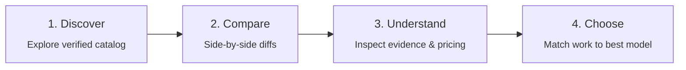

<div align="center">

<a href="https://github.com/D-Flint/ai-model-web">
  
</a>

# Synapse

**A consumer-first AI model decision engine for finding the right model for the work in front of you.**

[](https://astro.build)
[](https://react.dev)
[](https://www.typescriptlang.org/)
[](https://workers.cloudflare.com/)
[](LICENSE)

<p>
  <a href="#the-decision-journey">Decision Journey</a> &bull;
  <a href="#features">Features</a> &bull;
  <a href="#quick-start">Quick Start</a> &bull;
  <a href="#data-integrity--trust">Data Trust</a> &bull;
  <a href="#architecture">Architecture</a> &bull;
  <a href="#development-commands">Commands</a> &bull;
  <a href="#documentation">Documentation</a>
</p>

</div>

---

## The Decision Journey

Synapse translates scattered model specifications, public evaluations, pricing, and tradeoffs into guidance people can actually use. Rather than ranking models on an arbitrary score, it organizes around a four-stage decision progression:



> [!IMPORTANT]
> **A Decision Engine, Not a Leaderboard**
> Synapse does not reduce AI models to a single deceptive leaderboard rank. Raw benchmarks, derived scores, confidence intervals, source freshness, and reviewed API rates are presented as decision inputs—giving users clear context rather than substituting for testing on their own work.

---

## Features

| Capability  | What Synapse Provides                                                                                                               |
| :---------- | :---------------------------------------------------------------------------------------------------------------------------------- |
| **Explore** | Search and filter models across providers, capabilities, multimodal modalities, context length, pricing, and release dates.         |
| **Compare** | Place 2 to 4 models side by side, inspect meaningful parameter differences, and share persistent comparison permalinks.             |
| **Rank**    | Browse overall and task-focused rankings with transparent sort directions, evidence-aware eligibility, and plain-language guidance. |
| **Find**    | Answer 3 focused questions to receive an explainable, deterministic shortlist tailored to your use case, priorities, and budget.    |
| **Price**   | Compare reviewed API rates and calculate exact token workload costs without hidden assumptions or missing-data misrepresentation.   |
| **Verify**  | Inspect full provenance: source URLs, retrieval dates, confidence tiers, and calculation methodology instead of blind scores.       |

> [!NOTE]
> **Accessible, Resilient UI Architecture**
> The interface is fully responsive, theme-aware (dark/light), keyboard-accessible, and respects `prefers-reduced-motion`. Static content remains complete and readable without JavaScript; interactive filtering, comparisons, recommendations, and calculation controls use focused React islands.

---

## Quick Start

### Prerequisites

- **Node.js**: `24.x` recommended (`>=22.13.0` supported)
- **npm**: `10.x` or newer

> [!TIP]
> **Zero Configuration Required**
> No API keys, cloud accounts, or database connections are needed to run and explore Synapse locally. The app boots immediately with an offline validated catalog.

### Run Locally

```sh
# Clone the repository
git clone https://github.com/D-Flint/ai-model-web.git
cd ai-model-web

# Install dependencies
npm install

# Start local Astro development server
npm run dev
```

Open [http://localhost:4321](http://localhost:4321) in your browser to explore the application.

### Production Build & Preview

```sh
# Build static assets and edge worker bundles
npm run build

# Preview the production build locally
npm run preview
```

`npm run build` automatically pre-computes comparison artifacts required by the Cloudflare Workers configuration.

---

## Data Integrity & Trust

Synapse keeps different kinds of information explicitly partitioned so the interface never blurs a verifiable provider fact, an external evaluation, and an estimated cost into the same claim.

| Information Tier       | What It Informs                                                  | Retained Provenance & Guardrails                                                        |
| :--------------------- | :--------------------------------------------------------------- | :-------------------------------------------------------------------------------------- |
| **Provider Facts**     | Modalities, context limits, availability, and reviewed API rates | Direct publisher URL, source type, retrieval timestamp, and verification date.          |
| **Public Evaluations** | Capability evidence and specialized rankings                     | Original benchmark value, native scale, normalized 0–100 score, source, and date.       |
| **Derived Scores**     | Overall capability and task-specific rankings                    | Methodology version, supporting evidence references, update date, and confidence level. |
| **Estimates**          | User-entered token workload cost calculations                    | User inputs, pricing scope, and explicit missing-rate indicators. Never assumed free.   |

### Data Provenance Guarantees

- **Runtime Catalog**: At runtime, the application validates `src/data/verifiedModels.json` using strict Zod schemas. If absent, invalid, or empty, it safely falls back to explicitly labeled local fixtures with zero confidence.
- **Reviewed Pricing Boundary**: Ingestion-stage price hints are not published automatically. The pricing interface requires reviewed rates; unverified pricing is displayed as unavailable rather than zero.
- **Inspectable Methodology**: See the [Pricing Methodology](docs/pricing-methodology.md) and [Data Pipeline Guide](docs/data-pipeline.md) for full calculation formulas and schemas.

---

## Architecture

Synapse combines the speed and SEO of Astro server-rendered pages with lightweight React 19 islands where interactive client state is needed.

```text
ai-model-web/
├── src/
│   ├── pages/         Astro routes, SEO content, and dynamic comparison endpoints
│   ├── layouts/       Root HTML shell, navigation, theme switching, and metadata
│   ├── components/    Astro presentation layouts and interactive React islands
│   ├── data/          Validated catalog schemas, scoring configurations, and sources
│   ├── lib/           Scoring algorithms, rankings, comparisons, and recommendations
│   ├── pipeline/      Source adapters, normalization, confidence scoring, and assembly
│   └── db/            Drizzle ORM schema, migrations, and PostgreSQL persistence
├── scripts/           Catalog ingestion, scoring updates, and artifact pre-computation
├── tests/             Vitest unit/integration suites and Python browser flow checks
├── docs/              Methodology specifications, operational guides, and architectural notes
└── public/            Brand assets, provider logos, favicon, and crawler policy
```

### Technology Stack

| Layer                     | Technologies                                                                       | Role                                                                     |
| :------------------------ | :--------------------------------------------------------------------------------- | :----------------------------------------------------------------------- |
| **Core Framework**        | [Astro 5](https://astro.build)                                                     | Route handling, static site generation, metadata, and HTML shells        |
| **Interactive Islands**   | [React 19](https://react.dev)                                                      | Comparison matrix, filter bars, finder wizard, and price calculator      |
| **Styling**               | [Tailwind CSS v4](https://tailwindcss.com)                                         | Responsive utility styling and CSS custom property theming               |
| **Type Safety & Schemas** | [TypeScript 5.7](https://www.typescriptlang.org/), [Zod](https://zod.dev)          | End-to-end type safety and runtime schema validation                     |
| **Database & ORM**        | [Drizzle ORM](https://orm.drizzle.team), [PostgreSQL](https://www.postgresql.org/) | Immutable snapshot persistence and versioned catalog storage (optional)  |
| **Edge Deployment**       | [Cloudflare Workers](https://workers.cloudflare.com/)                              | Hybrid rendering for static pages and on-demand `/compare/[pair]` routes |

---

## Development Commands

### Core Workflows

| Command           | Action                                                                 |
| :---------------- | :--------------------------------------------------------------------- |
| `npm run dev`     | Start the Astro development server with hot reloading.                 |
| `npm run build`   | Prepare comparison pre-computations and build for production.          |
| `npm run preview` | Serve the production build locally for verification.                   |
| `npm run check`   | Run Astro checks and strict TypeScript type-checking (`tsc --noEmit`). |
| `npm run lint`    | Run ESLint and Prettier checks across the codebase.                    |
| `npm run format`  | Auto-format source code, tests, scripts, and configurations.           |

### Testing & Verification

| Command                        | Action                                                                   |
| :----------------------------- | :----------------------------------------------------------------------- |
| `npm test`                     | Run the Vitest unit, domain logic, and data-integrity test suite.        |
| `npm run test:browser`         | Execute Python Playwright browser flow tests against a running server.   |
| `npm run test:pricing:browser` | Test pricing flows, model comparison, finder wizard, and mobile layouts. |
| `npm run test:cloudflare`      | Verify Cloudflare Workers comparison route pre-generation behavior.      |

> [!NOTE]
> Browser test suites require Python, Playwright, and Chromium:
>
> ```sh
> pip install playwright
> python -m playwright install chromium
> ```

### Catalog & Ingestion Pipeline

Synapse provides granular ingestion scripts as well as a full pipeline runner:

| Command                          | Target Ingestion Source                                                       |
| :------------------------------- | :---------------------------------------------------------------------------- |
| `npm run data:refresh`           | Execute the complete ingestion, normalization, and scoring pipeline.          |
| `npm run data:openrouter`        | Ingest OpenRouter metadata, modalities, and pricing inputs.                   |
| `npm run data:lmarena`           | Ingest LMSYS Chatbot Arena human evaluation scores.                           |
| `npm run data:swebench`          | Ingest SWE-bench coding capability benchmarks.                                |
| `npm run data:livebench`         | Refresh the LiveBench benchmark evaluation snapshot.                          |
| `npm run data:catalog:livebench` | Filter and select the eligible LiveBench model catalog.                       |
| `npm run data:speed`             | Refresh OpenRouter token throughput and latency metrics.                      |
| `npm run data:official`          | Verify model specifications against official provider documentation.          |
| `npm run data:scores`            | Recalculate derived scores using current evidence and scoring weights.        |
| `npm run data:import -- <file>`  | Validate and archive an external catalog JSON snapshot to `src/data/history`. |

### Database Persistence (Optional)

When a PostgreSQL database is configured via `DATABASE_URL`:

```sh
npm run db:migrate                       # Apply Drizzle migrations
npm run data:persist -- <catalog.json>   # Persist reviewed catalog snapshot
npm run data:pricing:persist             # Persist reviewed API pricing snapshot
```

---

## Environment Variables

Copy [`.env.example`](.env.example) to `.env` and configure only the variables needed for your specific workflow. Never commit secrets to version control.

| Variable             | Required   | Default                 | Purpose                                                                                                  |
| :------------------- | :--------- | :---------------------- | :------------------------------------------------------------------------------------------------------- |
| `SITE_URL`           | Production | _None_                  | Canonical origin used to generate sitemaps and metadata tags. Leave unset in local development.          |
| `DATABASE_URL`       | Optional   | _None_                  | PostgreSQL connection string for Drizzle migrations and immutable persistence. Not needed for local dev. |
| `OPENROUTER_API_KEY` | Optional   | _None_                  | Authentication key to bypass rate limits during OpenRouter catalog ingestion.                            |
| `HF_TOKEN`           | Optional   | _None_                  | Hugging Face user token to access gated evaluation datasets.                                             |
| `ASTRA_TEST_URL`     | Optional   | `http://localhost:4321` | Overrides target address for Playwright browser test suites.                                             |

---

## Quality & Deployment

### Pre-Flight Verification

Before submitting changes or deploying updates, ensure all quality checks pass cleanly:

```sh
npm test          # Vitest domain and data validation
npm run check     # Astro & TypeScript diagnostic check
npm run lint      # ESLint and Prettier formatting validation
npm run build     # Production build & comparison bundle generation
```

### Cloudflare Workers Deployment

Synapse is configured for deployment to **Cloudflare Workers**. The static pages are served from the edge, while dynamic comparison pairs (`/compare/[pair]`) are rendered on demand.

```sh
npm run deploy    # Executes 'npm run build' followed by 'wrangler deploy'
```

> [!CAUTION]
> **Crawler Indexing Policy**
> The included `public/robots.txt` disallows search crawler indexing (`User-agent: * Disallow: /`). Do not remove this boundary until catalog data review and claims are formally validated for public release. For configuration details, see the [Cloudflare Workers Guide](docs/cloudflare-workers.md).

---

## Documentation

Detailed architectural and operational documentation is available in [`docs/`](docs/):

- [Architecture & Design](docs/implementation-design.md) — Route map, state boundaries, and UX constraints.
- [Data Pipeline](docs/data-pipeline.md) — Sources, adapters, normalization formulas, and database schema.
- [Pricing Methodology](docs/pricing-methodology.md) — Pricing publication boundaries, currency handling, and calculator scope.
- [Cloudflare Workers Guide](docs/cloudflare-workers.md) — Deployment setup, worker configuration, and rollbacks.
- [Data Refresh Plan](docs/PLAN_DATA_REFRESH_WORKFLOW.md) — Automation strategy and refresh cycle design.
- [Verification Record](docs/verification.md) — Test logs, validation benchmarks, and known limitations.
- [Session Log](SESSION_LOG.md) — Concise log of repository changes, implementation attempts, and handoffs.

---

## License

Synapse is open-source software licensed under the [AGPL-3.0 License](LICENSE).
Maintained by [D-Flint](https://github.com/D-Flint) &bull; Repository: [D-Flint/ai-model-web](https://github.com/D-Flint/ai-model-web).
